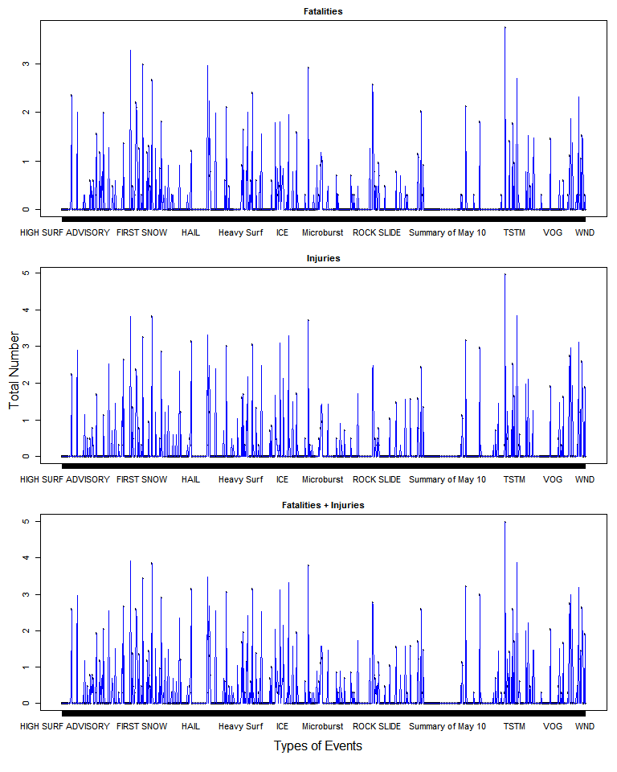
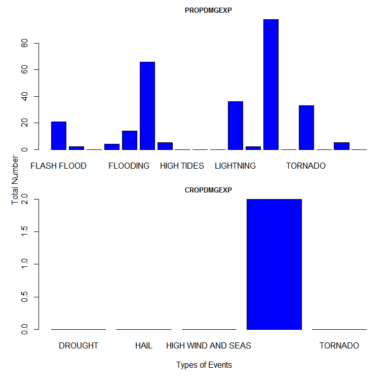
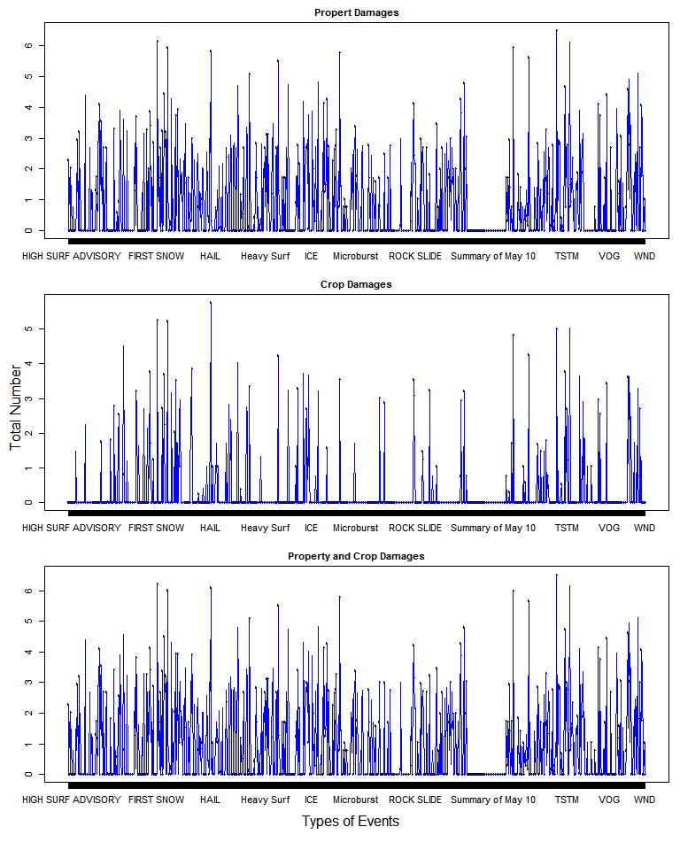

# RRPA2: Find Severe Weather Events Types Which Have the Greatest Impacts on Population Health and Economic Consequences

## Synopsis  

In this report we aim to find the severe weather events types which have the greatest impacts on population health and economic consequences across the United States.   

To find such severe weather events types, we obtained the data from the U.S. National Oceanic and Atmospheric Administration's (NOAA) storm database. The events in the database start in the year 1950 and end in November 2011.   
 
From these data, we found that, in terms of fatalities, injuries, or fatalities plus injuries, TORNADO is the most harmful event type with respect to population health. And EXCESSIVE HEAT is the 2nd most harmful event type with respect to population health in terms of fatalities plus injuries across the United States.     

We also found that in terms of property damge, crop damage, or property damge plus crop damage, event type TORNADO, HAIL, and TORNADO have the greatest economic consequences respectively. And FLASH FLOOD has the 2nd greatest economic consequences in terms of property damge plus crop damage across the United States.  

## Data Processing

The U.S. National Oceanic and Atmospheric Administration's (NOAA) storm database tracks characteristics of major storms and weather events in the United States, including when and where they occur, as well as estimates of any fatalities, injuries, and property damage. The data comes in the form of a comma-separated-value file compressed via the bzip2 algorithm to reduce its size. We obtain the data from the course web site: [Storm Data](https://d396qusza40orc.cloudfront.net/repdata%2Fdata%2FStormData.csv.bz2) [47MB]  

There is also some documentation of the database available. We can find how some of the variables are constructed/defined.  

- National Weather Service [Storm Data Documentation](https://d396qusza40orc.cloudfront.net/repdata%2Fpeer2_doc%2Fpd01016005curr.pdf)
- National Climatic Data Center Storm Events [FAQ](https://d396qusza40orc.cloudfront.net/repdata%2Fpeer2_doc%2FNCDC%20Storm%20Events-FAQ%20Page.pdf)  

The events in the database start in the year 1950 and end in November 2011. In the earlier years of the database there are generally fewer events recorded, most likely due to a lack of good records. More recent years should be considered more complete.

### Reading the Storm Data

We first unzip the [Storm Data](https://d396qusza40orc.cloudfront.net/repdata%2Fdata%2FStormData.csv.bz2) using the tool such as [TarTool](http://tartool.codeplex.com/) and save it as the .csv file "repdata_data_StormData.csv" in the current working directory.


```r
# Set to the current working directory
# Assume repdata_data_StormData.csv is in the current working directory
library(knitr)
opts_chunk$set(echo=TRUE, cache=TRUE, results='markup')

# This chunk will cache its results and only re-evaluate when changes are present
# Load the data 
StormData <- read.csv("./repdata_data_StormData.csv")
```

After reading the storm data, we first check the structure of the dataset

```r
str(StormData)
```

```
## 'data.frame':	902297 obs. of  37 variables:
##  $ STATE__   : num  1 1 1 1 1 1 1 1 1 1 ...
##  $ BGN_DATE  : Factor w/ 16335 levels "1/1/1966 0:00:00",..: 6523 6523 4242 11116 2224 2224 2260 383 3980 3980 ...
##  $ BGN_TIME  : Factor w/ 3608 levels "00:00:00 AM",..: 272 287 2705 1683 2584 3186 242 1683 3186 3186 ...
##  $ TIME_ZONE : Factor w/ 22 levels "ADT","AKS","AST",..: 7 7 7 7 7 7 7 7 7 7 ...
##  $ COUNTY    : num  97 3 57 89 43 77 9 123 125 57 ...
##  $ COUNTYNAME: Factor w/ 29601 levels "","5NM E OF MACKINAC BRIDGE TO PRESQUE ISLE LT MI",..: 13513 1873 4598 10592 4372 10094 1973 23873 24418 4598 ...
##  $ STATE     : Factor w/ 72 levels "AK","AL","AM",..: 2 2 2 2 2 2 2 2 2 2 ...
##  $ EVTYPE    : Factor w/ 985 levels "   HIGH SURF ADVISORY",..: 834 834 834 834 834 834 834 834 834 834 ...
##  $ BGN_RANGE : num  0 0 0 0 0 0 0 0 0 0 ...
##  $ BGN_AZI   : Factor w/ 35 levels "","  N"," NW",..: 1 1 1 1 1 1 1 1 1 1 ...
##  $ BGN_LOCATI: Factor w/ 54429 levels "","- 1 N Albion",..: 1 1 1 1 1 1 1 1 1 1 ...
##  $ END_DATE  : Factor w/ 6663 levels "","1/1/1993 0:00:00",..: 1 1 1 1 1 1 1 1 1 1 ...
##  $ END_TIME  : Factor w/ 3647 levels ""," 0900CST",..: 1 1 1 1 1 1 1 1 1 1 ...
##  $ COUNTY_END: num  0 0 0 0 0 0 0 0 0 0 ...
##  $ COUNTYENDN: logi  NA NA NA NA NA NA ...
##  $ END_RANGE : num  0 0 0 0 0 0 0 0 0 0 ...
##  $ END_AZI   : Factor w/ 24 levels "","E","ENE","ESE",..: 1 1 1 1 1 1 1 1 1 1 ...
##  $ END_LOCATI: Factor w/ 34506 levels "","- .5 NNW",..: 1 1 1 1 1 1 1 1 1 1 ...
##  $ LENGTH    : num  14 2 0.1 0 0 1.5 1.5 0 3.3 2.3 ...
##  $ WIDTH     : num  100 150 123 100 150 177 33 33 100 100 ...
##  $ F         : int  3 2 2 2 2 2 2 1 3 3 ...
##  $ MAG       : num  0 0 0 0 0 0 0 0 0 0 ...
##  $ FATALITIES: num  0 0 0 0 0 0 0 0 1 0 ...
##  $ INJURIES  : num  15 0 2 2 2 6 1 0 14 0 ...
##  $ PROPDMG   : num  25 2.5 25 2.5 2.5 2.5 2.5 2.5 25 25 ...
##  $ PROPDMGEXP: Factor w/ 19 levels "","-","?","+",..: 17 17 17 17 17 17 17 17 17 17 ...
##  $ CROPDMG   : num  0 0 0 0 0 0 0 0 0 0 ...
##  $ CROPDMGEXP: Factor w/ 9 levels "","?","0","2",..: 1 1 1 1 1 1 1 1 1 1 ...
##  $ WFO       : Factor w/ 542 levels ""," CI","$AC",..: 1 1 1 1 1 1 1 1 1 1 ...
##  $ STATEOFFIC: Factor w/ 250 levels "","ALABAMA, Central",..: 1 1 1 1 1 1 1 1 1 1 ...
##  $ ZONENAMES : Factor w/ 25112 levels "","                                                                                                                               "| __truncated__,..: 1 1 1 1 1 1 1 1 1 1 ...
##  $ LATITUDE  : num  3040 3042 3340 3458 3412 ...
##  $ LONGITUDE : num  8812 8755 8742 8626 8642 ...
##  $ LATITUDE_E: num  3051 0 0 0 0 ...
##  $ LONGITUDE_: num  8806 0 0 0 0 ...
##  $ REMARKS   : Factor w/ 436774 levels "","-2 at Deer Park\n",..: 1 1 1 1 1 1 1 1 1 1 ...
##  $ REFNUM    : num  1 2 3 4 5 6 7 8 9 10 ...
```

Then we check the first few rows. There are 902,297 rows and 37 columns in this dataset.

```r
dim(StormData)
```

```
## [1] 902297     37
```


```r
head(StormData[, 1:14])
```

```
##   STATE__           BGN_DATE BGN_TIME TIME_ZONE COUNTY COUNTYNAME STATE
## 1       1  4/18/1950 0:00:00     0130       CST     97     MOBILE    AL
## 2       1  4/18/1950 0:00:00     0145       CST      3    BALDWIN    AL
## 3       1  2/20/1951 0:00:00     1600       CST     57    FAYETTE    AL
## 4       1   6/8/1951 0:00:00     0900       CST     89    MADISON    AL
## 5       1 11/15/1951 0:00:00     1500       CST     43    CULLMAN    AL
## 6       1 11/15/1951 0:00:00     2000       CST     77 LAUDERDALE    AL
##    EVTYPE BGN_RANGE BGN_AZI BGN_LOCATI END_DATE END_TIME COUNTY_END
## 1 TORNADO         0                                               0
## 2 TORNADO         0                                               0
## 3 TORNADO         0                                               0
## 4 TORNADO         0                                               0
## 5 TORNADO         0                                               0
## 6 TORNADO         0                                               0
```

We also check a few types of events (there are 985 different types of events in the dataset)

```r
events <- unique(StormData$EVTYPE)
length(events)
```

```
## [1] 985
```


```r
events[1:40]
```

```
##  [1] TORNADO                        TSTM WIND                     
##  [3] HAIL                           FREEZING RAIN                 
##  [5] SNOW                           ICE STORM/FLASH FLOOD         
##  [7] SNOW/ICE                       WINTER STORM                  
##  [9] HURRICANE OPAL/HIGH WINDS      THUNDERSTORM WINDS            
## [11] RECORD COLD                    HURRICANE ERIN                
## [13] HURRICANE OPAL                 HEAVY RAIN                    
## [15] LIGHTNING                      THUNDERSTORM WIND             
## [17] DENSE FOG                      RIP CURRENT                   
## [19] THUNDERSTORM WINS              FLASH FLOOD                   
## [21] FLASH FLOODING                 HIGH WINDS                    
## [23] FUNNEL CLOUD                   TORNADO F0                    
## [25] THUNDERSTORM WINDS LIGHTNING   THUNDERSTORM WINDS/HAIL       
## [27] HEAT                           WIND                          
## [29] LIGHTING                       HEAVY RAINS                   
## [31] LIGHTNING AND HEAVY RAIN       FUNNEL                        
## [33] WALL CLOUD                     FLOODING                      
## [35] THUNDERSTORM WINDS HAIL        FLOOD                         
## [37] COLD                           HEAVY RAIN/LIGHTNING          
## [39] FLASH FLOODING/THUNDERSTORM WI WALL CLOUD/FUNNEL CLOUD       
## 985 Levels:    HIGH SURF ADVISORY  COASTAL FLOOD ... WND
```


## Results

### Data analysis for which types of events are most harmful with respect to population health across the United States  

For the impact to the populaiton health, we will look at the data variables "FATALITIES" and "INJURIES". 


```r
# Aggregate the (FATALITIES + INJURIES) in dataset for the all types of events 
Fatality_Injury <- aggregate( cbind(FATALITIES, INJURIES) ~  EVTYPE, data=StormData, sum)

# Add a new column "Total" which is the sum of FATALITIES and INJURIES
Fatality_Injury$Total <- Fatality_Injury$FATALITIES + Fatality_Injury$INJURIES
```

In order to show the total number of Fatalities, Injuries, and (Fatalities + Injuries) for all types of events, we make a panel plot of graph with types of events as axis, and the total number of Fatalities, Injuries, and (Fatalities + Injuries) as y-axis. Here, we take the log of the total number to adjust for the skew in the data.


```r
par(mfrow=c(3,1), mar=c(3,2,2,1), oma=c(3,2,0,0))
plot(Fatality_Injury$EVTYPE, log10(Fatality_Injury$FATALITIES+1), type="p",  
     xlab="", ylab="", main="Fatalities", cex.main=1.0)
lines(Fatality_Injury$EVTYPE,log10(Fatality_Injury$FATALITIES+1), type="l", col="blue") 
plot(Fatality_Injury$EVTYPE, log10(Fatality_Injury$INJURIES+1), type="p",  
     xlab="", ylab="", main="Injuries", cex.main=1.0)
lines(Fatality_Injury$EVTYPE,log10(Fatality_Injury$INJURIES+1), type="l", col="blue") 
plot(Fatality_Injury$EVTYPE, log10(Fatality_Injury$Total+1), type="p",  
     xlab="", ylab="", main="Fatalities + Injuries", cex.main=1.0)
lines(Fatality_Injury$EVTYPE,log10(Fatality_Injury$Total+1), type="l", col="blue") 
mtext("Total Number", side=2, outer=TRUE)
mtext("Types of Events", side=1, outer=TRUE)
```

 

We look at the new dataset Fatality_Injury to find the max number of Fatalities, Injuries, and (Fatalities + Injuries).

- Find the max number of Fatalities in the new dataset. It is 5,633 and the corresponding event type is TORNADO. 


```r
# max number of FATALITIES
max(Fatality_Injury$FATALITIES)
```

```
## [1] 5633
```


```r
# max impact of the event type
max_impact_event<- Fatality_Injury[Fatality_Injury$FATALITIES==max(Fatality_Injury$FATALITIES), ][1]
print(max_impact_event, type="html")
```

```
##      EVTYPE
## 834 TORNADO
```

- Find the max number of Injuries in the new dataset. It is 91,346 and the corresponding event type is TORNADO.


```r
# max number of INJURIES
max(Fatality_Injury$INJURIES)
```

```
## [1] 91346
```


```r
# max impact of the event type
max_impact_event<- Fatality_Injury[Fatality_Injury$INJURIES==max(Fatality_Injury$INJURIES), ][1]
print(max_impact_event, type="html")
```

```
##      EVTYPE
## 834 TORNADO
```

- Find the max number of (Fatalities + Injuries) in the new dataset. It is 96,979 and the corresponding event type is TORNADO

```r
# max number of total number for (FATALITIES + INJURIES)
max(Fatality_Injury$Total)
```

```
## [1] 96979
```


```r
# max impact of the event type
max_impact_event<- Fatality_Injury[Fatality_Injury$Total==max(Fatality_Injury$Total), ][1]
print(max_impact_event, type="html")
```

```
##      EVTYPE
## 834 TORNADO
```

  
- We also look at the 2nd largest number of (FATALITIES + INJURIES) in  the new dataset. It is 8,428 and the corresponding event type is EXCESSIVE HEAT.

```r
Fatality_Injury[Fatality_Injury$Total==max(Fatality_Injury$Total), ][4] <- 0
max(Fatality_Injury$Total)
```

```
## [1] 8428
```


```r
# max impact of the event type
max_impact_event<- Fatality_Injury[Fatality_Injury$Total==max(Fatality_Injury$Total), ][1]
print(max_impact_event, type="html")
```

```
##             EVTYPE
## 130 EXCESSIVE HEAT
```

From the above data analysis, we conclude that    

- If we only look at the Fatalities, the event type "TORNADO" is the most harmful with respect to population health across the United States, which has the totla number of 5,633   

- If we only look at the Injuries, the event type "TORNADO" is the most harmful with respect to population health across the United States, which has the totla number of 91,346  

- If we look at the Fatalities together with Injuries, the event type "TORNADO" is the most harmful with respect to population health across the United States, which has the totla number of 96,979  

- If we look at the Fatalities together with Injuries again, the event type "EXCESSIVE HEAT" is the 2nd most harmful with respect to population health across the United States, which has the total numner of 8,428  

### Data analysis for which types of events have the greatest economic consequences across the United States

For the impact to the economic consequences, we will look at the data varibales "PROPDMG", "PROPDMGEXP", "CROPDMG", and "CROPDMGEXP".   

For "PROPDMGEXP" and "CROPDMGEXP", there are some data with non-numeric values such as "", "-", "?", "+", etc. We will process these non-numeric values as NA


```r
# Process data for "PROPDMG", "PROPDMGEXP", "CROPDMG", and "CROPDMGEXP" with "EVTYPE
new_data <-StormData[, c("PROPDMG", "PROPDMGEXP", "CROPDMG", "CROPDMGEXP", "EVTYPE")]

# Remove the level info and convert PROPDMGEXP to numeric with "NA" 
new_data$PROPDMGEXP <- as.numeric(levels(new_data$PROPDMGEXP))[new_data$PROPDMGEXP]

# Remove the level info and convert CROPDMGEXP to numeric with "NA" 
new_data$CROPDMGEXP <- as.numeric(levels(new_data$CROPDMGEXP))[new_data$CROPDMGEXP]
```

We will use aggregate to compute the total number for variables "PROPDMG", "PROPDMGEXP", "CROPDMG", and "CROPDMGEXP" for each type of event.


```r
# Aggregate the PROPDMG in dataset for the all types of events 
Prop_Dmg <- aggregate( PROPDMG ~ EVTYPE, data=new_data, sum)

# Aggregate the PROPDMGEXP in dataset for the all types of events 
Prop_DmgExp <- aggregate( PROPDMGEXP ~ EVTYPE, data=new_data, sum, na.action = na.omit)

# Aggregate the CROPDMG in dataset for the all types of events 
Crop_Dmg <- aggregate( CROPDMG ~ EVTYPE, data=new_data, sum)

# Aggregate the CROPDMGEXP in dataset for the all types of events 
Crop_DmgExp <- aggregate( CROPDMGEXP ~ EVTYPE, data=new_data, sum, na.action = na.omit)
```

- Look at the max number for variable "PROPDMG" from dataset "Prop_Dmg". It is 3,212,258 and the event type corresponding to the max number is TORNADO. 

```r
# Find the max number for Property damage
max(Prop_Dmg$PROPDMG)
```

```
## [1] 3212258
```


```r
# max impact of the event type
max_impact_event<- Prop_Dmg[Prop_Dmg$PROPDMG==max(Prop_Dmg$PROPDMG), ][1]
print(max_impact_event, type="html")
```

```
##      EVTYPE
## 834 TORNADO
```

- Look at the max number for variable "CROPDMG" from dataset "Crop_Dmg". It is 579,596.30 and the event type corresponding to the max number is HAIL.

```r
# Find the max number for Crop damage
max(Crop_Dmg$CROPDMG)
```

```
## [1] 579596.3
```


```r
# max impact of the event type
max_impact_event<- Crop_Dmg[Crop_Dmg$CROPDMG==max(Crop_Dmg$CROPDMG), ][1]
print(max_impact_event, type="html")
```

```
##     EVTYPE
## 244   HAIL
```

- Look at the data for variables "PROPDMGEXP" and "CROPDMGEXP". 

```r
par(mfrow=c(2,1), mar=c(3,2,2,1), oma=c(3,2,0,0))
barplot(Prop_DmgExp$PROPDMGEXP, names.arg=Prop_DmgExp$EVTYPE, 
        xlab="", ylab="", main="PROPDMGEXP", col="blue", cex.main=0.8)
barplot(Crop_DmgExp$CROPDMGEXP, names.arg=Crop_DmgExp$EVTYPE, 
        xlab="", ylab="", main="CROPDMGEXP", col="blue", cex.main=0.8)
mtext("Total Number", side=2, outer=TRUE)
mtext("Types of Events", side=1, outer=TRUE)
```

 

From the plot, we find that the total numbers for "PROPDMGEXP" and "CROPDMGEXP" are very small compared to the total number of "PROPDMG" and "CROPDMG". Thus we will ignore the total numbers for "PROPDMGEXP" and "CROPDMGEXP" and only look at data for variables "PROPDMG" and "CROPDMG".   

- Let's look at the number from PROPDMG, CROPDMG, and (PROPDMG + CROPDMG) by plotting the diagrams

```r
# merge the dataset Prop_Dmg and Crop_Dmg
Property_Corp_Damage <- merge(Prop_Dmg, Crop_Dmg, by="EVTYPE")

# add a new column "Total" which is the sum of PROPDMG and CROPDMG
Property_Corp_Damage$Total <- Property_Corp_Damage$PROPDMG + Property_Corp_Damage$CROPDMG
```


```r
par(mfrow=c(3,1), mar=c(3,2,2,1), oma=c(3,2,0,0))
plot(Property_Corp_Damage$EVTYPE, log10(Property_Corp_Damage$PROPDMG+1), type="p",  
     xlab="", ylab="", main="Propert Damages", cex.main=1.0)
lines(Property_Corp_Damage$EVTYPE,log10(Property_Corp_Damage$PROPDMG+1), type="l", col="blue") 

plot(Property_Corp_Damage$EVTYPE, log10(Property_Corp_Damage$CROPDMG+1), type="p",  
     xlab="", ylab="", main="Crop Damages", cex.main=1.0)
lines(Property_Corp_Damage$EVTYPE,log10(Property_Corp_Damage$CROPDMG+1), type="l", col="blue") 

plot(Property_Corp_Damage$EVTYPE, log10(Property_Corp_Damage$Total+1), type="p",  
     xlab="", ylab="", main="Property and Crop Damages", cex.main=1.0)
lines(Property_Corp_Damage$EVTYPE,log10(Property_Corp_Damage$Total+1), type="l", col="blue") 
mtext("Total Number", side=2, outer=TRUE)
mtext("Types of Events", side=1, outer=TRUE)
```

 

- Look at the max number for (PROPDMG + CROPDMG) in the new dataset. It is 3,312,277 and the event type corresponding to the max number is TORNADO.

```r
# max number of (PROPDMG + CROPDMG)
max(Property_Corp_Damage$Total)
```

```
## [1] 3312277
```


```r
# max impact of the event type
max_impact_event<- Property_Corp_Damage[Property_Corp_Damage$Total==max(Property_Corp_Damage$Total), ][1]
print(max_impact_event, type="html")
```

```
##      EVTYPE
## 834 TORNADO
```

- Let's find the 2nd largest number in this new dataset. We find the 2nd largest number is 1,599,325 and corresponding event type is FLASH FLOOD


```r
# reset the max Total =0 in ordere to find the 2nd largest number
Property_Corp_Damage[Property_Corp_Damage$Total==max(Property_Corp_Damage$Total), ][4] <- 0
max(Property_Corp_Damage$Total)
```

```
## [1] 1599325
```


```r
max_impact_event <- Property_Corp_Damage[Property_Corp_Damage$Total==max(Property_Corp_Damage$Total), ][1] 
print(max_impact_event, type="html")
```

```
##          EVTYPE
## 153 FLASH FLOOD
```

From the above data analysis, we conclude that    

- If we only look at the Property Damage, the type of event "TORNADO" has the greatest economic consequences across the United States, which has the totla number of 3,212,258 

- If we only look at the Crop Damage, the type of event "HAIL" has the greatest economic consequences across the United States, which has the totla number of 579,596.30

- If we look at the sum of Property Damage and Crop Damage, the type of event "TORNADO" has the greatest economic consequences across the United States, which has the totla number of 3,312,277   

- If we look at the sum of Property Damage and Crop Damage again, the type of event "FLASH FLOOD" has the 2nd greatest economic consequences across the United States, which has the totla number of 1,599,325 

